<div align="center">
  

  <br>

  
  
  
  
  
  

  <br><br>

  <strong>Base Steak 2.0</strong> · by <strong>MD Anik Hasan (Sawlper)</strong><br>
  Local-first Windows desktop source for chat, research, model workflows, and permission-gated computer work.
</div>

### Insert cartridge

This repository is the application source: the interface, local service, native Windows hosts, orchestration, memory, research, training tools, and verification machinery.

Model weights, checkpoints, private datasets, tokenizer files, packaged runtimes, installed binaries, conversations, credentials, screenshots, and machine-local workspace data are deliberately absent. Bring the runtime; Git is not a model warehouse.

### The playable build

- **Chat that stays organized:** local conversations, attachments, per-chat context, explicit global memory, search, folders, and response provenance.
- **Four deliberate lanes:** Instant for direct replies, Cooking for longer model reasoning, Research for evidence-backed retrieval, and Agent for computer actions.
- **Research with receipts:** source pages enter a ledger, claims keep their evidence, and incomplete validation remains incomplete.
- **Native Windows control:** a C# WebView2 shell plus isolated browser and UI Automation hosts.
- **Permission before consequence:** capabilities pass through persisted grants, per-invocation policy, audit records, cancellation, and read-back verification.
- **Model workbench:** dataset inspection, preparation, training, evaluation, versions, and separately provisioned text, vision, and image runtimes.

The operating rule is pleasantly unglamorous: if nothing ran, the app is not allowed to declare victory.

### How a turn travels

1. The React interface sends the latest request and the selected mode to a loopback-only Python service.
2. The text model chooses a response, research job, image job, single action, or plan.
3. The runtime validates that route against the mode, available capabilities, connector state, and local policy.
4. Specialized workers do the bounded work: research, browser control, files, terminal, windows, input, UI Automation, or image generation.
5. The verifier observes the result again. Unknown is not silently promoted to success.
6. Chat receives the answer, evidence, artifacts, timing, and a readable activity trail; technical detail stays available without taking over the page.

That is the whole game loop. The boss battle is usually a stale state flag.

### Source map

- `app/frontend/` holds the React 18 and Vite 6 interface.
- `app/backend/` holds the loopback API, orchestration, memory, research, policy, training, runtime adapters, and tools.
- `app/desktop/native/` holds the Windows Forms and WebView2 desktop shell.
- `app/desktop/browser/` holds the isolated structured browser host.
- `app/desktop/uia/` holds the isolated Windows UI Automation host.
- `config/defaults.toml` contains safe source defaults. Private overrides belong outside version control.
- `.codex/config.toml` requests the preferred contributor model, context window, and compaction threshold for new trusted-project Codex sessions. Provider and runtime caps still apply.

### Start from source

You need Windows, Node.js with npm, a Python installation compatible with `requirements.txt`, and the .NET 8 SDK. Native project restore also needs access to NuGet.

```powershell
python -m venv .venv
.venv\Scripts\python.exe -m pip install -r requirements-dev.txt
npm ci
npm run build
npm run check:python
```

For split frontend and backend development, use two terminals:

```powershell
npm run server
```

```powershell
npm run dev
```

Vite serves the development interface at `http://127.0.0.1:5173`. Backend initialization and model-backed features still require a separately provisioned local workspace and runtime.

Build the three Windows hosts when working on the native shell or automation layer:

```powershell
npm run build:hosts
```

These commands build source projects. They do not produce the private, fully provisioned Salty Steak installation used by its owner.

### Memory without context soup

Conversation context belongs to its conversation. A new chat does not inherit another chat's instructions.

Global memory is a separate, explicit lane. The user chooses what to retain, can inspect it in the interface, and can remove it later. Retrieval is bounded and relevance-ranked so memory helps the current turn instead of becoming a second, noisier prompt.

### Local-first, honestly scoped

The service rejects non-loopback binds, and ignored `workspace/` paths hold local conversations, memory, artifacts, logs, and runtime state. Credentials remain machine-local and may use Windows DPAPI where the relevant connector supports it.

Local-first does not mean the network is imaginary. Research, browser automation, configured connectors, MCP services, and external links may access the network when the operator enables or requests them. Screen capture and computer automation can observe user-visible machine state after the required permission is granted.

### Verification cheatsheet

```powershell
npm ci
npm run build
npm run check:python
npm run build:hosts
```

The public source drop does not include private acceptance fixtures or the installed runtime. These checks prove source and host compilation, not model quality, packaged-runtime integrity, or live computer-control acceptance.

### License, identity, and the fine print

The application source is available under the [Salty Steak Source-Available License](LICENSE). It is not an open-source license. Viewing and running an unmodified copy are permitted within the license; modifying, rebranding, redistributing, sublicensing, selling, or removing attribution requires written permission from MD Anik Hasan (Sawlper).

**Salty Steak** and **Base Steak 2.0** identify work by **MD Anik Hasan (Sawlper)**. Third-party dependencies keep their own licenses. No model weights or third-party rights are granted by this repository.

<div align="center">
  <br>
  <sub>Built locally. Verified loudly. Seasoned to taste.</sub>
</div>
