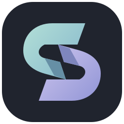
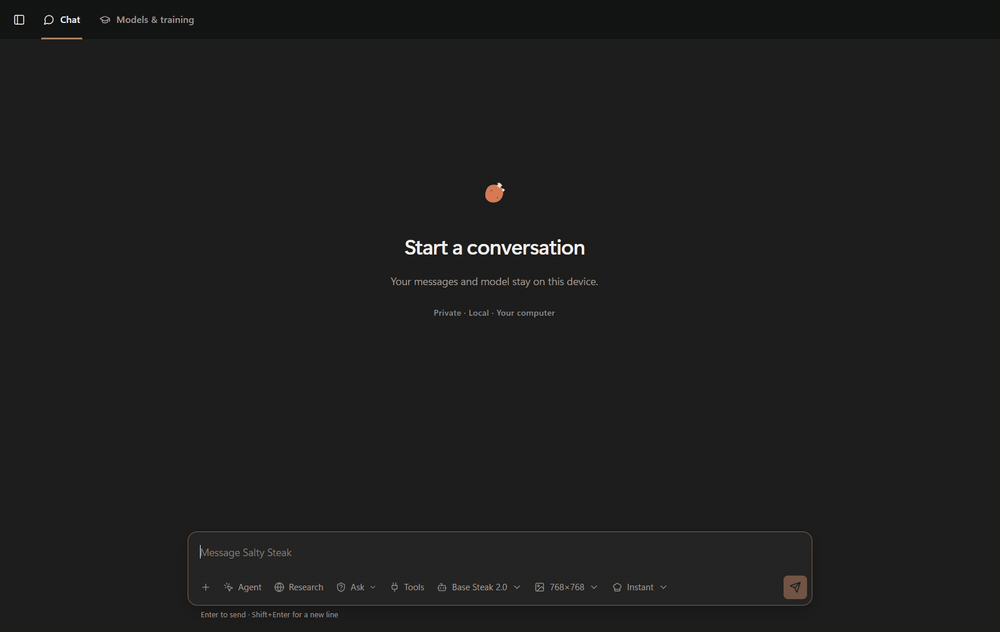

<div align="center">
  
  <h1>Salty Steak</h1>
  <p><strong>Base Steak 2.0 · by MD Anik Hasan (Sawlper)</strong></p>
  <p>I am building a local-first Windows harness for running, training, researching with, and giving tools to my own AI models.</p>

  <p>
    
    
    
    
    
    
    
    
  </p>
</div>

<p align="center">
  
</p>

<p align="center"><sub>Recorded from the installed Windows build in a fresh conversation. The answer is generated by the local Base Steak runtime; it is not overlaid or scripted.</sub></p>

## Why I started building this

I use AI every day, but I kept running into the same wall: most model runners and agent harnesses let me change a few settings while the important decisions stay somewhere else. I wanted to control the model, the context policy, the tools, the memory, the training workflow, the UI, the evidence, and what is allowed to leave my computer.

So I started building my own harness.

Salty Steak is the software around the model. I can use it as a private chat application, a research runner, an image workstation, a Windows operator, and a workbench for datasets, training, evaluation, and saved versions. The model decides what kind of job it is looking at; the application owns execution and state. I deliberately keep those responsibilities separate because a language model saying “done” is not the same thing as Windows, a database, or a website proving that the requested change happened.

This repository contains the harness, not my private model library. I do not publish weights, tokenizers, learned adapters, private runtime binaries, conversations, credentials, generated files, installed packages, or my machine-local workspace here.

## What I have working today

### Chat

- Separate conversation histories, search, folders, pins, attachments, retry, cancellation, response timing, and downloadable code artifacts.
- Instant and Cooking generation policies without printing the model's private scratch work into the answer.
- A live Activity view built from runtime and tool events instead of a decorative list written after completion.
- Per-conversation instructions and model settings. A new chat does not inherit another chat's hidden preferences.
- A role-based model selector for language, vision, and image workflows.

### Memory

I treat memory as three different things instead of calling every stored token “memory”:

- conversation context belongs to one chat;
- global memory contains facts I explicitly choose to keep;
- mission memory tracks objects, places, actions, and observations during longer computer tasks.

Global memory is inspectable and removable in the application. It uses SQLite WAL plus FTS search, and it stays separate from the temporary KV cache used during generation.

The current slash commands are:

- `/save mem` — save the current context, or the note written after the command, to global memory;
- `/image` — route the rest of the message to image generation;
- `/research` — route the rest of the message to source-backed research.

Aliases such as `/img`, `/photo`, `/search`, and `/web` are implemented in the composer parser. Typing `/` opens the actual command palette.

### Research

Research has its own query loop and ledger. I keep queries, source identity, extracted observations, claims, contradictions, confidence, and unresolved questions together so synthesis can tell the difference between three independent sources and three pages repeating one publisher.

The current profiles cover quick verification, normal research, and longer Cooking research. Their limits are ceilings rather than quotas: a run can stop when it has enough independent evidence, when searches stop producing useful material, or when I cancel it.

### Agent and Windows control

The model can request registered capabilities for files, terminal commands, applications, windows, keyboard and pointer input, screenshots, UI Automation, and the isolated browser. The application validates the capability name and arguments before anything runs.

One action and a multi-step plan use the same broker boundary. Plans are checked for missing dependencies, cycles, invalid connectors, unavailable capabilities, and authority before the first node starts. After execution, goal predicates are compared with newly observed state. That is the part that prevents a successful click from being mistaken for a successfully completed task.

Foreground automation yields when I take back the mouse or keyboard. I added that after learning that “technically working” and “letting me use my own monitor” are separate acceptance tests.

### Images and vision

Image generation and vision are separate runtime roles. A text model writes a durable render brief; the image worker receives subject, purpose, composition, style, required elements, and negative constraints as structured fields. Revisions merge into the original brief rather than throwing away the whole idea because the last message said “make the jacket darker.”

Vision inputs are staged with bounded size, one-use permission, and a separate worker. Attaching an image does not authorize an unrelated screen capture.

### Models and training

The workbench imports TXT, JSONL, JSON, CSV, and Parquet datasets. It records source lineage, tokenizer identity, split policy, packing, and truncation before training starts. Training operations have checkpoints, recovery state, evaluation, version registration, and promotion as separate stages.

I use the same application to train an app-native model from its configured architecture, continue a verified checkpoint, evaluate saved versions, and run the current protected identity post-training workflow for a compatible registered runtime. I do not describe all of those as one universal “Train” button because they have different compatibility and recovery requirements.

## How one request moves through the software

When I press Send, the flow is roughly this:

1. React writes the user turn against the selected conversation and sends an idempotency key, attachments, modes, and generation settings.
2. The loopback API validates the body, file limits, IDs, and multipart data before the application accepts ownership.
3. `ChatService` assembles only that conversation's context, reserves response space, inspects bounded attachment excerpts, and retrieves relevant explicit memory when enabled.
4. The local text runtime chooses a job shape: answer, one action, plan, research, image generation, or image revision.
5. Dispatch checks whether that route is available in the selected mode. JSON from the model is a request, not permission.
6. The matching runner performs the work through research, imaging, or the capability broker and streams live events back to Chat.
7. Verification observes the requested postconditions again. The final message records the route, timing, tokens, sources, tool results, artifacts, and completion state.

Long Agent missions keep a compact task state instead of feeding every screenshot and tool response back into the prompt. The visible conversation and the operator's working state have different jobs, so I store and budget them differently.

## The processes behind the window

`Salty Steak.exe` is a .NET 8 Windows Forms host. It owns the main window, WebView2 lifecycle, single-instance behavior, child-process cleanup, startup screen, and native bridge.

The compiled React application runs inside WebView2. A local Python service owns the API, databases, conversations, operations, model registry, training, research, memory, imaging, and automation broker. The service binds to loopback; it rejects a non-loopback host rather than quietly exposing the application to the LAN.

The language runtime is a supervised child process connected over anonymous pipes. It does not open another inference port. Vision, image generation, structured browsing, UI Automation, and elevated terminal work use separate workers so a failed model load or broken accessibility tree does not take the whole desktop window down with it.

The native host places the process tree in a Windows Job Object. Closing Salty Steak therefore closes the workers it created instead of leaving a GPU process wandering around after the UI disappears.

## Using a model with this harness

There are two implemented language-model paths in the source.

### App-native trainable checkpoints

The training workbench produces SafeTensors weights, tokenizer files, configuration, integrity metadata, and saved-version records in the private workspace. These versions can be verified, evaluated, activated in Chat, resumed when the checkpoint is compatible, and kept behind the application's recovery rules.

The architecture and training defaults live in `config/defaults.toml`. I keep personal paths and machine-specific overrides in ignored local configuration rather than editing the published defaults for one computer.

### Imported local model bundles

The model library discovers `model.json` files beneath `workspace/models/`. A bundle declares its role, local artifact, checksum, runtime family, supported context settings, companions, and activation state. Files must remain inside their bundle directory, and size/integrity mismatches fail closed.

The current direct native GGUF execution path is implemented for the `salty_native_steak20` runtime family. It is not a promise that an arbitrary GGUF from the internet will run unchanged. A compatible bundle also needs the matching private native runtime directory and a manifest accepted by the loader.

To support another open-weight architecture properly, I would add a runtime adapter under `app/backend/runtime/` that implements load, stream, cancel, unload, and describe; register its role and manifest contract; map tokenizer/chat-template behavior; and add isolated load plus generation acceptance. Renaming a runtime family in JSON is not an implementation.

Other roles already have registry contracts for vision-language, image generation, speech recognition, speech generation, embeddings, and reranking. Their selector can describe installed models, but a role becomes usable only when its execution pipeline is present and verified.

## Build and run the public source

This checkout targets Windows.

### Prerequisites

- Windows 10 or 11;
- Python with `venv` support;
- Node.js and npm;
- .NET 8 SDK with Windows Desktop support;
- Microsoft Edge WebView2 Runtime;
- a CUDA-capable PyTorch environment if I intend to train or run a compatible GPU model;
- NuGet and npm access for the initial dependency restore.

### 1. Clone and prepare the environment

```powershell
git clone https://github.com/mdanikhasan-me/Salty-Steak-.git
Set-Location "Salty-Steak-"

python -m venv .venv
.venv\Scripts\python.exe -m pip install --upgrade pip
.venv\Scripts\python.exe -m pip install -r requirements-dev.txt
npm ci
```

`requirements-dev.txt` includes the application requirements. The published dependency set currently targets CUDA 12.8 PyTorch on Windows, so CPU-only or another CUDA generation needs a deliberate dependency adjustment rather than a blind install.

### 2. Add machine-local configuration

`config/defaults.toml` is versioned. Personal changes belong in `config/local.toml`, which is ignored.

```toml
[server]
host = "127.0.0.1"

[training]
device = "cuda"
```

The default workspace is `workspace/`. It contains databases, conversations, datasets, versions, models, runtime files, logs, and generated artifacts. It is intentionally excluded from Git.

### 3. Run the development UI

Use two PowerShell terminals from the repository root.

```powershell
npm run server
```

```powershell
npm run dev
```

Vite serves the development interface and proxies API calls to the loopback Python service.

### 4. Build the public source

```powershell
npm run build
npm run check:python
npm run build:hosts
```

The host build compiles the main desktop shell, structured browser host, and UI Automation host. These commands produce developer output; they do not recreate my installed release or provision a private model library.

### 5. Register a compatible private runtime

Create a bundle directory below `workspace/models/`, place the local artifacts there, and provide a `model.json` that follows `salty-steak-model-bundle-v1`. The registry checks local filenames, roles, sizes, SHA-256 metadata, companion declarations, and runtime state. I recommend reading `app/backend/runtime/model_bundles.py` before writing a manifest because the loader is intentionally strict.

Do not commit the bundle, runtime binaries, tokenizer, adapters, or model manifest. A manifest often contains machine paths and non-public technical metadata even when the weight file itself is excluded.

## Repository map

- `app/frontend/` — React interface, chat workflows, settings, Activity, memory UI, and styles.
- `app/backend/api/` — loopback routes, upload boundaries, and response contracts.
- `app/backend/chat/` — context assembly, routing, task state, runners, activity, goals, and verification.
- `app/backend/runtime/` — language, vision, and image runtime adapters and worker clients.
- `app/backend/automation/` — capability registry, grants, policy, audit log, files, terminal, browser, and UI Automation clients.
- `app/backend/research/` — queries, retrieval loop, source processing, activity, and evidence ledger.
- `app/backend/memory/` — explicit global memory and mission state.
- `app/backend/datasets/`, `training/`, `evaluation/`, `versions/` — the model workbench lifecycle.
- `app/desktop/native/` — the main WebView2 Windows host.
- `app/desktop/browser/` — the isolated structured-browser host.
- `app/desktop/uia/` — the isolated Windows accessibility host.
- `config/` — safe published defaults; private overrides stay ignored.

## What I want to build next

The next major layer is an in-app skill system. I want a skill to package instructions, capability requirements, input/output contracts, validation, and reusable helpers without hard-coding every workflow into ChatService. The important part is not adding another menu full of prompts. A skill should make repeated work cheaper and more consistent while leaving the model free to reason about the specific task.

I also plan to keep improving runtime adapters, long-task memory, research validation, computer-use speed, connector workflows, and model training/evaluation from the same workbench. New model roles will be marked available only when their actual worker and acceptance path exist.

## Public and private boundary

The repository contains source required to understand and build the application harness. It excludes my model weights, checkpoints, tokenizers, adapters, datasets, private runtimes, installed binaries, credentials, chats, screenshots, databases, generated artifacts, local validation evidence, editor state, and recovery bundles.

The GIF above is the only published conversation capture. I recorded it in a temporary fresh chat, verified the real local answer, and deleted that conversation immediately after capture.

## About the reconstructed Git dates

I began the project in January 2026 before this GitHub repository existed. The source survived a failed drive and a move to another computer, but the original local timestamps did not. The January-to-August dates in the older history are sequence-preserving reconstructed estimates. The commits and their file changes are real; the exact old clock times are not presented as forensic evidence.

## License

The [Salty Steak Source-Available License](LICENSE) permits viewing the source and running an unmodified copy for the uses it describes. Modification, rebranding, redistribution, sublicensing, selling, hosted-service use, or removal of attribution requires written permission from me, **MD Anik Hasan (Sawlper)**.

Third-party dependencies retain their own licenses. No rights are granted to private model weights, checkpoints, datasets, tokenizers, runtimes, or other artifacts that are not included in this repository.

<p align="center"><sub>Built and maintained by MD Anik Hasan (Sawlper).</sub></p>
