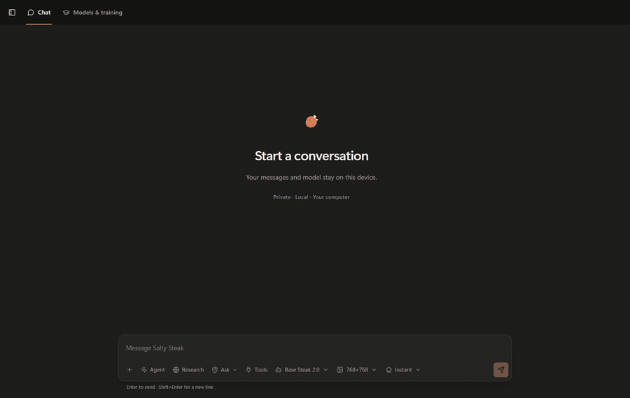

<div align="center">
  
  <h1>Salty Steak</h1>
  <p><strong>Base Steak 2.0 · by MD Anik Hasan (Sawlper)</strong></p>
  <p>A local-first Windows harness for running, training, researching with, and giving tools to my own AI models.</p>

  <p>
    
    
    
    
    
    
    
    
  </p>
</div>

<p align="center">
  
</p>

<p align="center"><sub>Recorded from the installed Windows build in a fresh conversation. The local Base Steak runtime generated the answer; it is not overlaid or scripted.</sub></p>

## Overview

Salty Steak is the Windows application and execution harness I use around local AI models. It combines private chat, explicit memory, source-backed research, image workflows, computer-use tools, datasets, training, evaluation, and saved model versions in one desktop interface.

The model is responsible for interpreting the request and choosing a job shape. The application owns everything that needs deterministic state: conversation boundaries, permissions, capabilities, persistence, cancellation, recovery, audit records, and verification. A generated sentence cannot grant itself a tool or prove that an external action happened.

This repository contains the buildable harness. It does not contain my model weights, tokenizers, learned adapters, private runtime binaries, datasets, credentials, conversations, generated files, installed packages, or machine-local workspace.

## Install and set up the source

The current checkout targets Windows 10 or 11.

### Prerequisites

- Python with `venv` support;
- Node.js and npm;
- .NET 8 SDK with Windows Desktop support;
- Microsoft Edge WebView2 Runtime;
- NuGet and npm access for the initial restore;
- a compatible CUDA environment if I intend to train or run a GPU model.

### 1. Clone and install dependencies

```powershell
git clone https://github.com/mdanikhasan-me/Salty-Steak-.git
Set-Location "Salty-Steak-"

python -m venv .venv
.venv\Scripts\python.exe -m pip install --upgrade pip
.venv\Scripts\python.exe -m pip install -r requirements-dev.txt
npm ci
```

`requirements-dev.txt` includes the application requirements. The published dependency set currently targets CUDA 12.8 PyTorch on Windows. A CPU-only installation or another CUDA generation needs a deliberate dependency change rather than a blind install.

### 2. Create machine-local configuration

`config/defaults.toml` is versioned. Personal paths and device choices belong in the ignored `config/local.toml`.

```toml
[server]
host = "127.0.0.1"

[training]
device = "cuda"
```

The default private workspace is `workspace/`. The application creates its control database, conversations, datasets, prepared data, model versions, evaluations, model library, runtime files, artifacts, cache, and logs below that directory. Git ignores the entire workspace.

### 3. Start the development application

Use two PowerShell terminals in the repository root.

```powershell
npm run server
```

```powershell
npm run dev
```

Vite serves the React interface and proxies API calls to the loopback Python service.

### 4. Build the public source

```powershell
npm run build
npm run check:python
npm run build:hosts
```

`build:hosts` compiles the main desktop shell, structured-browser host, and UI Automation host. These commands produce developer builds. They do not recreate my installed release or provision a private model runtime.

### 5. Add a compatible local model

The model registry discovers `model.json` files below `workspace/models/`. I place each private artifact and its manifest in its own bundle directory. The manifest follows `salty-steak-model-bundle-v1` and declares the role, local filename, expected size, SHA-256, runtime family, context policy, companion artifacts, and activation state.

The registry deliberately rejects paths that escape the bundle, malformed companion declarations, missing files, and size or integrity mismatches. Before creating a manifest, read `app/backend/runtime/model_bundles.py`; the loader is strict by design.

The current direct native GGUF path is implemented for the `salty_native_steak20` runtime family. An arbitrary GGUF cannot become compatible by changing a JSON label. Supporting another open-weight architecture requires a runtime adapter, tokenizer and chat-template mapping, isolated load verification, streaming, cancellation, unload, and generation acceptance. The compatibility design is explained in more detail below.

Do not commit model bundles, manifests containing machine-local metadata, runtime binaries, weights, tokenizers, or adapters.

## What the application can do

### Chat

- Separate conversation histories, search, folders, pins, attachments, retry, cancellation, timing, and downloadable code artifacts.
- Per-conversation instructions and generation settings; a new chat does not inherit another chat's hidden preferences.
- Instant and Cooking generation policies without printing private scratch work into the answer.
- A live Activity view produced from runtime and tool events, not a decorative timeline assembled afterward.
- Role-aware selection for language, vision, and image workflows.

### Memory and slash commands

I keep three kinds of state separate:

- conversation context belongs to one chat;
- global memory contains facts I explicitly choose to retain;
- mission memory tracks places, objects, actions, and observations during longer computer tasks.

Global memory is searchable, inspectable, and removable in the application. It uses SQLite WAL and FTS search rather than pretending a model KV cache is durable storage.

The published composer commands are:

- `/save mem` — save the current context, or the note following the command, to global memory;
- `/image` — route the rest of the message to image generation;
- `/research` — route the rest of the message to source-backed research.

Aliases such as `/img`, `/photo`, `/search`, and `/web` are parsed by the composer. Typing `/` opens the actual command palette.

<p align="center">
  
</p>

<p align="center"><sub>This second native recording uses another fresh temporary chat. It selects `/save mem` but deliberately does not submit it, so the demonstration writes no memory.</sub></p>

### Research

Research owns a query loop and evidence ledger. The ledger keeps queries, source and publisher identity, extracted observations, claims, contradictions, confidence, and unresolved questions together. Repeated pages from one publisher do not count as independent confirmation.

Ten copies of the same press release are still one source wearing ten hats. The ledger is intentionally unimpressed by the costume change.

Quick verification, ordinary research, and longer Cooking research use separate profiles. Their budgets are ceilings rather than quotas: a run can finish once it has enough independent evidence, stop when new queries become unproductive, or end when I cancel it.

### Agent and Windows control

The model can request registered capabilities for files, terminal commands, applications, windows, keyboard and pointer input, screenshots, Windows UI Automation, and the isolated browser. The broker validates the capability name, arguments, selected mode, authority, and consequence before execution.

One action and a multi-step plan cross the same invocation boundary. Plans are checked for missing dependencies, cycles, invalid connectors, unavailable capabilities, and authority before the first node runs. After execution, verification observes the requested postconditions again. A successful click is evidence about the click, not proof that the whole task finished.

Foreground automation yields when I take back the mouse or keyboard. I added that because an automation can be technically functional and still make the computer unusable for its owner.

### Images and vision

Image generation and vision are separate runtime roles. The text model creates a durable render brief containing purpose, subject, composition, style, required elements, and negative constraints. Revisions merge into that brief rather than replacing it with the latest six words in the conversation.

Vision inputs use bounded staging, one-use permission, integrity checks, and an isolated worker. Attaching an image does not authorize an unrelated screen capture.

### Datasets, training, and versions

The workbench imports TXT, JSONL, JSON, CSV, and Parquet. Preparation records source lineage, schema, tokenizer identity, split policy, packing, and truncation before training begins.

Training operations keep recovery checkpoints. Finalization, isolated load, evaluation, version registration, policy checks, and promotion are separate stages. I can train an app-native model from the configured architecture, continue a compatible verified checkpoint, evaluate saved versions, and run the current protected identity post-training workflow for a compatible registered runtime.

Those workflows share one UI, but they are not the same operation. An imported inference bundle does not automatically become trainable, and a checkpoint should not be promoted because its folder name contains the word `final`.

`final-final-really-final` remains a filename, not an evaluation method.

## Software specifications

<p align="center">
  
</p>

### Desktop and interface

- Native host: .NET 8 Windows Forms.
- Embedded interface: React 18 compiled with Vite and hosted in WebView2.
- Main-window responsibilities: single-instance behavior, startup state, native bridge, DPI-aware windowing, child-process supervision, and cleanup.
- Platform: Windows x64; the UI and automation hosts use Windows-specific APIs.

### Local service and persistence

- Application service: Python, bound to loopback only.
- API transport: local HTTP for the UI; non-loopback server hosts are rejected.
- Control state: SQLite with WAL, schema migration, operation reconciliation, and persistent event records.
- Global and mission memory: separate memory tables plus FTS retrieval.
- Durable domains: conversations, messages, operations, datasets, prepared artifacts, training, versions, evaluations, image jobs, grants, notifications, connectors, audit records, and generated artifacts.

### Runtime isolation

- Language generation: persistent supervised child worker over UTF-8 JSON lines and anonymous pipes.
- Vision and image generation: separate isolated workers with their own manifests and lifecycle.
- Structured browsing: separate WebView2 browser host.
- Windows accessibility: separate UI Automation host.
- Elevated terminal work: narrow worker boundary rather than elevation of the whole desktop application.
- Process cleanup: native hosts and model workers are placed in a Windows Job Object.

### Model registry

- Bundle schema: `salty-steak-model-bundle-v1`.
- Registered roles: text generation, vision-language, image generation, speech recognition, speech generation, embeddings, and reranking.
- Routing policy: one selected runtime per role.
- Integrity boundary: bundle-local paths, declared sizes, SHA-256 metadata, companion validation, and fail-closed activation.
- Implemented language paths: app-native SafeTensors checkpoints and the compatible private `salty_native_steak20` GGUF worker path.

### Files and artifacts

- Dataset input: TXT, JSONL, JSON, CSV, and Parquet.
- Chat attachments: bounded local inspection for text, source, structured documents, office documents, and supported archives.
- Generated code: complete fenced files can be exposed as downloadable byte-for-byte artifacts.
- Generated images: persisted jobs and artifacts with cancellation and restart reconciliation.

## How one request moves through the harness

1. React writes the user turn against the selected conversation and sends an idempotency key, attachments, modes, and generation settings.
2. The loopback API validates IDs, body limits, multipart data, and staged files before the application accepts ownership.
3. `ChatService` loads only that conversation, budgets context, reserves response space, inspects bounded attachment excerpts, and retrieves relevant explicit memory when enabled.
4. The local text runtime chooses a job shape: answer, one action, plan, research, image generation, or image revision.
5. Dispatch checks whether the chosen route is available in the selected mode. Model-generated JSON is a request, not permission.
6. The matching runner performs the work through research, imaging, or the capability broker and streams live events to Chat.
7. Goal predicates are checked against newly observed state. The final message records route, timing, tokens, sources, tool results, artifacts, and completion state.

Long Agent missions maintain compact task state instead of feeding every screenshot and tool response back into the conversation. The visible chat and the operator's working state have different retention rules because they solve different problems.

## Process architecture

`Salty Steak.exe` owns the desktop window and starts the local application service. The compiled React interface runs inside its WebView2 surface. Python owns the API, model registry, operations, persistence, Chat, memory, research, training, imaging, and automation broker.

The language worker does not open another inference port. Requests carry an ID over anonymous pipes; streamed events and the final result return with that ID. Cancellation has its own signal path, and an unresponsive worker can be retired without taking the window with it.

Vision, image generation, browsing, UI Automation, and elevated terminal work are separate because they fail differently. A broken accessibility tree should not be reported as a model failure, and unloading an image model should not kill conversation storage.

I could have made this one enormous process. That design is wonderfully simple until the first image-model unload takes Chat, the database, and the window with it.

## Model compatibility and training paths

### App-native checkpoints

The trainable path stores SafeTensors weights, tokenizer files, configuration, integrity metadata, and saved-version records in the private workspace. Compatible versions can be evaluated, activated in Chat, continued, recovered, and promoted through the operation system.

Architecture and training defaults live in `config/defaults.toml`. I keep machine-specific overrides in ignored configuration instead of changing public defaults for one workstation.

### Imported bundles

Imported bundles are immutable model-library artifacts. Registration is not execution: the runtime family named by the manifest must have a real adapter and the bundle must pass its activation contract.

The current native GGUF route directly supports the runtime family implemented in `app/backend/runtime/salty_native.py` and its worker. Another open-weight model family needs an adapter that implements load, warm-up, streaming generation, cancellation, unload, runtime description, tokenizer and template behavior, and acceptance checks. This is the extension point I use instead of embedding architecture-specific behavior in the React UI or Chat router.

Vision, diffusion, speech, embedding, and reranking models have separate role contracts. A role is shown as available only after its actual worker and validation path exist.

## Source-tree guide

- `app/frontend/` — React interface, state, chat workflows, settings, Activity, memory UI, and styles.
- `app/backend/api/` — loopback routes, upload boundaries, and response contracts.
- `app/backend/chat/` — context assembly, routing, task state, runners, activity, goals, and verification.
- `app/backend/runtime/` — language, vision, and image adapters plus worker clients.
- `app/backend/automation/` — capabilities, grants, policy, audit records, files, terminal, browser, and UI Automation clients.
- `app/backend/research/` — query loop, retrieval, source processing, activity, and evidence ledger.
- `app/backend/memory/` — explicit global memory and mission state.
- `app/backend/datasets/`, `training/`, `evaluation/`, `versions/` — the model-workbench lifecycle.
- `app/desktop/native/` — main Windows/WebView2 host.
- `app/desktop/browser/` — isolated structured-browser host.
- `app/desktop/uia/` — isolated Windows accessibility host.
- `config/` — safe public defaults; private overrides stay ignored.

## Planned skill system

The next major layer is an in-app skill system. I want a skill to package instructions, capability requirements, input and output contracts, validation, and reusable helpers without hard-coding every workflow into `ChatService`.

The goal is not another menu full of stored prompts. A useful skill should reduce repeated model work, improve output consistency, expose the tools it needs, and still let the model reason about the specific request. I also plan to keep extending runtime adapters, long-task memory, research validation, computer-use speed, connectors, and training/evaluation from the same workbench.

## Why I built my own harness

I did not start this because the world was short of chat boxes. I use AI every day, but most runners and agent harnesses give me a few visible settings while the important decisions remain fixed elsewhere. I wanted control over the model, runtime, context policy, tools, memory, training workflow, UI, evidence, and what is allowed to leave my computer.

I also wanted one application where training and use are not unrelated products. If I prepare a dataset, train or fine-tune a compatible model, evaluate it, save a version, and activate it, I want the lineage and recovery state to remain visible in the same workbench that later runs the model.

I wanted something I could open, inspect, break, understand, and repair without waiting for a product roadmap to notice the same problem. Some weeks that freedom feels like engineering. Some weeks it feels like personally inventing a new way to lose an evening to a focus bug. Both are honest parts of owning the stack.

That is why Salty Steak is more than a chat wrapper for me. It is the software boundary where a model becomes an application I can change and hold accountable for what it actually did.

## Public and private boundary

The repository contains source required to understand and build the application harness. It excludes my weights, checkpoints, tokenizers, adapters, datasets, private runtimes, installed binaries, credentials, chats, databases, generated artifacts, local validation evidence, editor state, and recovery bundles.

The GIF at the top is the only published conversation capture. I recorded it in a temporary fresh chat, verified the real local answer, and deleted that conversation immediately afterward.

## Reconstructed Git dates

I began the project in January 2026 before this GitHub repository existed. The source survived a failed drive and a move to another computer, but the original local timestamps did not. The January-to-August dates in the older history are sequence-preserving reconstructed estimates. The commits and file changes are real; the old clock times are not presented as forensic evidence.

## License

The [Salty Steak Source-Available License](LICENSE) permits viewing the source and running an unmodified copy for the uses it describes. Modification, rebranding, redistribution, sublicensing, selling, hosted-service use, or removal of attribution requires written permission from me, **MD Anik Hasan (Sawlper)**.

Third-party dependencies keep their own licenses. No rights are granted to private model weights, checkpoints, datasets, tokenizers, runtimes, or other artifacts not included in this repository.

<p align="center"><sub>Built and maintained by MD Anik Hasan (Sawlper).</sub></p>
